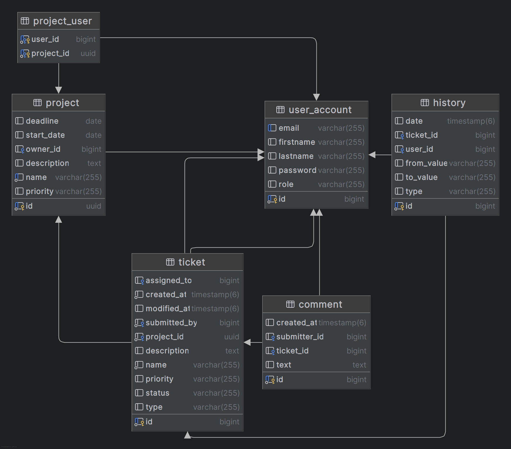

# Psira

A bug tracker application written in Java 21 with Spring Boot for the backend, Postgresql for the database
and React with Vite for the Frontend.
<br>


## Features

- JWT Authentication
- Role-Based Authorization
- Project Management
- Ticket Tracking
- Exception Handling

## Overview

There are 4 roles. **Admin** , **Project Manager**, **Developer** and **Submitter**.
<br>
Managers create and manage projects. Developers are assigned to tickets for resolving.
Submitters submit tickets for each project. Admins can manage everything.
<br>
Each user (except for the admins) can only see the projects and the tickets that he has been assigned to.

### Projects

A project has a number of tickets that are being used to track its progress.
There is also a deadline and a priority.


<br>
<br>


### Tickets

A ticket has a status which indicates the progress of the ticket, a priority and a type (Bug fix, new feature etc.).
<br>
Users can communicate and add comments to each ticket.
<br>
Any change made to a ticket, is tracked and shown in the history of the ticket.


## How to run

First clone the repository.

```
git clone https://github.com/DimMil24/Psira.git
cd Psira
```

On first startup the database is going to populate itself with some demo data. If you don't want this, comment out line 18 in this [file](backend\src\main\java\com\dimmil\bugtracker\config\StartupRunner.java) before proceeding.

You can run the app locally or with docker.

### Local

#### Backend

You need to run the database first, then the app.

```
cd backend
docker compose up
./mvnw spring-boot:run
```

#### Frontend

```
cd frontend
npm install
npm run dev
```

### Docker

To run the app with docker, you need to first build the jar, and then run docker compose:

```
cd backend
./mvnw clean package -DskipTests
cd ..
docker compose up --build
```

The app will be available on localhost:3000.<br>
If you didn't disable the demo data, for the username you can use any of the roles (admin, manager, developer, submitter) and for the password 123.

## Diagram


