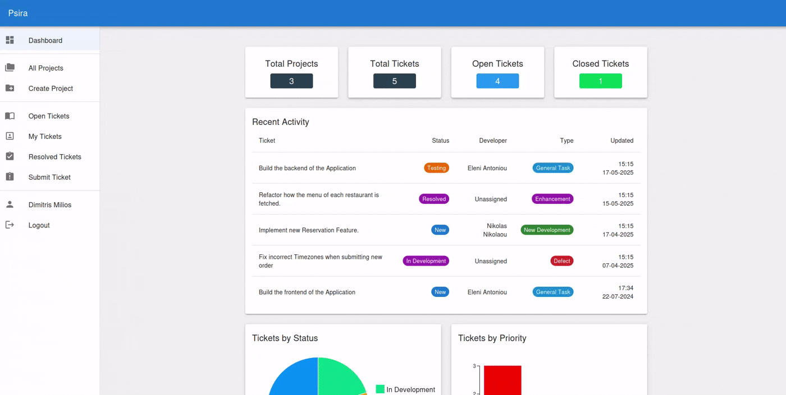

# Psira

A bug tracker application written in Java 21 with Spring Boot for the backend, Postgresql for the database
and React for the Frontend.
 
This repository contains the frontend of the app. For the backend click [here](https://github.com/DimMil24/Psira-backend)
 

## Features

The frontend is built using Vite and the Material UI Library. For routing react-router is used.
For details on the project's structure go to the backend [page](https://github.com/DimMil24/Psira-backend).
