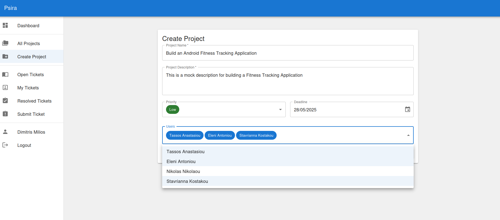
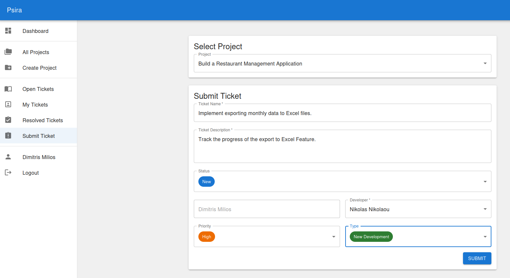
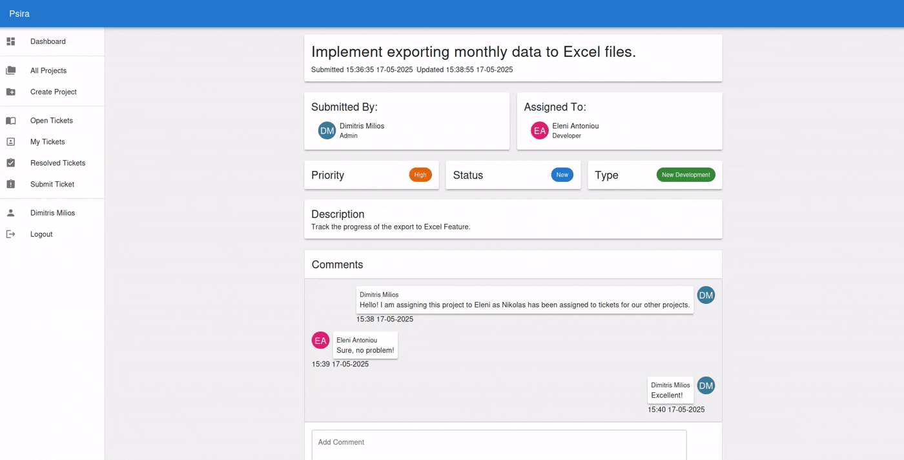

# Psira
A bug tracker application written in Java 21 with Spring Boot for the backend, Postgresql for the database
and React for the Frontend.
 
This repository contains the backend of the app. For the frontend click [here](https://github.com/DimMil24/Psira-frontend)
 

##  Features
- JWT Authentication
- Role-Based Authorization
- Project Management
- Ticket Tracking
- Exception Handling

## Overview
There are 4 roles. **Admin** , **Project Manager**, **Developer** and **Submitter**.
 
Managers create and manage projects. Developers are assigned to tickets for resolving.
Submitters submit tickets for each project. Admins can manager everything.
 
Each user (except for the admins) can only see the projects and the tickets that he is a part of.

### Projects
A project has a number of tickets that are being used to track its progress.
There is also a deadline and a priority.

 
 

### Tickets
A ticket has a status which indicates the progress of the ticket, a priority and a type (Bug fix, new feature etc.).
 
Users can communicate and add comments to each ticket.
 
Any change made to a ticket is tracked and shown in the history of the ticket.

